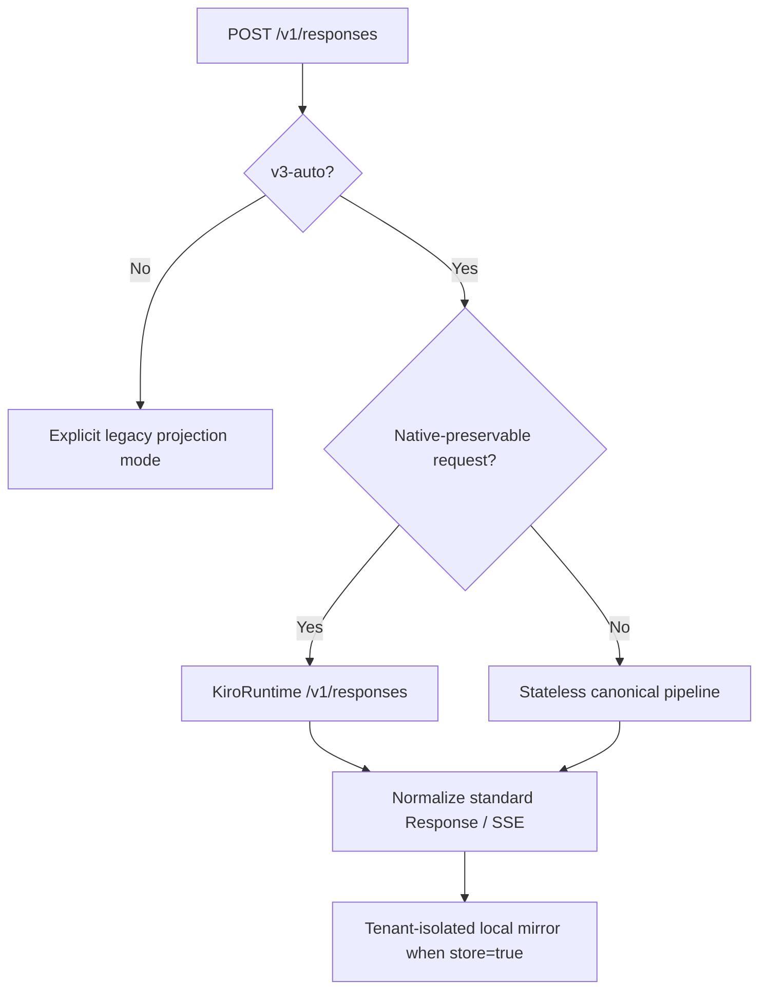

# V3 protocol compatibility

> **Status**: current V3 contract
> **Audience**: operators, client authors, and release reviewers

## TL;DR

V3 makes OpenAI Responses the primary public interface. The default
`v3-auto` mode sends ordinary requests to KiroRuntime's native
`POST /v1/responses` operation and automatically uses the mature stateless
pipeline for request shapes that the native operation cannot preserve.
Unsupported OpenAI capabilities return typed OpenAI error envelopes; they are
not silently discarded.

## Table of contents

- [1. Public HTTP surface](#1-public-http-surface)
- [2. V3 transport selection](#2-v3-transport-selection)
- [3. Native Responses lane](#3-native-responses-lane)
- [4. Stateless compatibility lane](#4-stateless-compatibility-lane)
- [5. Stored response lifecycle](#5-stored-response-lifecycle)
- [6. Request capability matrix](#6-request-capability-matrix)
- [7. Native-context decision](#7-native-context-decision)
- [8. Error and telemetry contract](#8-error-and-telemetry-contract)
- [9. Data-retention boundary](#9-data-retention-boundary)
- [10. Validation evidence](#10-validation-evidence)
- [11. Fidelity controls and verified boundaries](#11-fidelity-controls-and-verified-boundaries)

## 1. Public HTTP surface

| Method and path                      | V3 behavior                                                                                                |
| ------------------------------------ | ---------------------------------------------------------------------------------------------------------- |
| `POST /v1/responses`                 | Streaming and non-streaming Responses creation.                                                            |
| `GET /v1/responses/{id}`             | Retrieves the tenant-isolated local response mirror.                                                       |
| `DELETE /v1/responses/{id}`          | Deletes the local mirror and blocks later gateway continuation.                                            |
| `GET /v1/responses/{id}/input_items` | Cursor pagination with `after`, `limit` 1–100, and `order` defaulting to `desc`.                           |
| `POST /v1/responses/{id}/cancel`     | Returns `response_not_cancellable` for mirrored terminal responses; background execution is not supported. |
| `POST /v1/responses/input_tokens`    | Recognized route; returns HTTP 501 `unsupported_endpoint`.                                                 |
| `POST /v1/responses/compact`         | Recognized route; returns HTTP 501 `unsupported_endpoint`.                                                 |
| `POST /v1/messages`                  | Anthropic Messages compatibility surface.                                                                  |
| `POST /v1/messages/count_tokens`     | Anthropic-compatible estimate with `x-kiro-token-count-mode: estimate`.                                    |
| `POST /v1/chat/completions`          | Legacy route, disabled unless `enable_legacy_chat_completions` is true.                                    |

The official OpenAI Responses resource also defines create, retrieve, delete,
cancel, and input-item methods. V3 implements those core lifecycle shapes
locally because KiroRuntime exposes only native response creation and
continuation.

### Anthropic Messages / Claude Code boundary

Claude Code 2.1.270 is validated against the stateless canonical lane. The
adapter accepts current text, image, standard tool/result, mid-conversation
system, adaptive thinking, effort, temperature, cache-hint, and lossless
context-management shapes. `thinking.display: "omitted"` uses a tenant/model/output-bound
`kr2_` token as the opaque Anthropic signature so the original signed Kiro
reasoning can be restored without exposing its text. Current tokens authenticate
an absolute TTL and mint protocol/region/profile/operation; legacy `kr1_` remains
readable but owner-bound. Empty signed Claude thinking is preserved. Cache markers remain
performance hints: `x-kiro-prompt-cache-mode` reports `server-auto`,
`explicit-checkpoints`, or `off`; measured cache read/write buckets are mapped
and unknown buckets are `null`, never fabricated as zero. The same verified
account-failover gate used by Responses applies to omitted Messages thinking;
currently only provenance-authenticated Claude Sonnet 5 signed text minted via
KiroRuntime `GenerateAssistantResponse` with a profile in `us-east-1` is enabled.

Only `clear_thinking_20251015` with `keep: "all"` is accepted for
`context_management`; it returns `applied_edits: []`. Destructive edits,
Structured Outputs outside the bounded `single-string-object-v1` profile
(see the Anthropic Messages variant in section 4), forced/serial tool controls,
and unknown semantic fields remain explicit `invalid_request_error` failures. Streaming emits ordered
Anthropic blocks and keep-alive `ping` events. `x-claude-code-session-id` is
consumed as a tenant-scoped affinity key and is never logged verbatim.

GPT-5.6 Sol/Terra/Luna remain fail-closed for Anthropic `max_tokens` by
default. A caller can opt into the exact
`x-kiro-output-token-limit-mode: advisory` compatibility header; only those
three GPT wire models then omit Claude Code's required limit before Kiro,
return `advisory-unenforced`, and emit a structured audit event. This exception
does not alter the OpenAI surfaces or the probe-backed Claude `max_tokens`
projection. Claude Code 2.1.263's `modelPicker.behavesAs` supplies GPT rows with
effort/xhigh/max UI; the resulting `output_config.effort` is translated to
Kiro GPT `reasoning.effort`.

## 2. V3 transport selection



The stateless lane is selected for:

- `store: false`;
- effective `max` effort after explicit parameter/alias/config normalization;
- custom grammar tools and unverified native bridge combinations;
- Codex `additional_tools` and `agent_message`;
- `parallel_tool_calls: false` with callable tools;
- `include: ["reasoning.encrypted_content"]` or input containing a provider `kr1_` or `kr2_` token;
- the compatible-mode local `single-string-object-v1` structured-output profile.

If a request references a native stored response, it stays on the native lane.
A later request that would require switching that native lineage to the
stateless lane fails explicitly instead of weakening `store`, effort, tool, or
reasoning semantics.

## 3. Native Responses lane

The native lane calls:

```text
https://runtime.<region>.kiro.dev/v1/responses
```

Kiro CLI 2.21.1 uses the same KiroRuntime host. GPT Mantle routing is
server-side; the CLI does not call a separate public Mantle endpoint.

Verified native capabilities:

| Capability                      | GPT-5.6 Sol                                                               | Claude Opus 5                                               |
| ------------------------------- | ------------------------------------------------------------------------- | ----------------------------------------------------------- |
| `instructions`                  | Supported                                                                 | Forwarded; priority remains unverified in us-east-1         |
| Standard Responses JSON and SSE | Supported                                                                 | Supported                                                   |
| Function tools                  | Supported                                                                 | Supported                                                   |
| `previous_response_id`          | Durable owner binding; exact replay for affected opaque reasoning history | Full stored history replay into CreateResponse in us-east-1 |
| `max_output_tokens`             | Supported                                                                 | Supported                                                   |
| `reasoning.effort: xhigh`       | Supported                                                                 | Supported                                                   |
| `truncation: disabled`          | Supported                                                                 | Supported                                                   |
| `truncation: auto`              | Supported                                                                 | Rejected locally                                            |
| `temperature`                   | Rejected locally                                                          | Supported                                                   |
| `top_p`                         | Rejected locally                                                          | Rejected locally                                            |
| `max` effort                    | Routed to stateless lane                                                  | Routed to stateless lane                                    |

Private upstream fields such as `billing` are removed. The public response
retains the requested model variant and normalized OpenAI fields.

## 4. Stateless compatibility lane

The fallback lane converts the request into the provider's canonical IR and
then uses the established CodeWhisperer/Kiro stream pipeline. It preserves:

- leading, intermediate, and trailing instruction order;
- non-empty text bytes, including whitespace-only input;
- images, inline documents, tool results, and their current-input boundary,
  including one inline image block lifted from a function/custom tool result
  without losing its adjacent text or tool association;
- function tools, custom grammar tools, and namespace identity through
  request-local private aliases;
- Codex collaboration `agent_message` content and author/recipient metadata;
- signed or redacted Kiro reasoning replay through TTL- and mint-provenance-bound `kr2_` tokens, with owner-bound legacy `kr1_` reads.
- recovery of legacy Claude Code turns containing multiple distinct empty direct `thinking` blocks by omitting all ambiguous replay envelopes while preserving visible assistant/tool history; the compatibility loss is explicit in `x-kiro-reasoning-replay-mode: conflict-omitted` and a sanitized audit event.
- complete Messages tool history when the current client withdraws a tool such as `TaskOutput`. Historical declarations do not authorize new output: the current `tools` and schemas alone determine which calls the provider accepts.

For Fable Messages with enabled thinking and effective `display: omitted`, an
upstream prefix containing distinct signature-only reasoning events can be
omitted in full. The provider inspects the entire prefix before `message_start`,
within 128 events and 1 MiB, then continues the original generation without
retrying. No thinking block, replay capture, database row or `kr1_`/`kr2_` token
is produced for that omitted reasoning. The response includes
`x-kiro-reasoning-replay-mode: conflict-omitted`; the
`anthropic_output_reasoning_conflict_omitted` audit contains only the model,
direction, counts and byte length, never signatures or their hashes.

Identical duplicate signatures retain their normal replay behavior. Non-empty,
redacted, mixed, oversized or late conflicts remain fatal, as do conflicts for
other models or explicit `display: summarized`. Before publication the error
can be HTTP 502; after publication the stream terminates with an SSE error and
no successful terminal event. Fable's default effective omitted display does
not change the existing distinction between native signatures by default and
provider tokens for explicitly requested omitted display.

Withdrawing a tool preserves its visible history but can still change a signed
upstream prefix. Cross-account replay support does not guarantee compatibility
with arbitrary system/tool/history changes; preserve the original signed
context or transfer visible task state to a fresh conversation.

In `v3-auto`, this lane uses the explicit legacy instruction prefix only when
the native Responses lane cannot represent the request. It never moves a
trailing instruction suffix into earlier history or creates an empty current
user message.

> [!IMPORTANT]
> `parallel_tool_calls: false` is accepted for current Codex compatibility,
> but Kiro does not expose a protocol-level serial-tool guarantee. Clients
> requiring a hard provider-enforced serial guarantee must enforce it in their
> own tool scheduler.

### Bounded local structured-output profile

`responses_fidelity_mode: "compatible"` admits one provider-local profile named
`single-string-object-v1`. It is recognized only from protocol structure: a
strict `json_schema` whose root object has exactly one required string property,
`additionalProperties: false`, and integer `minLength`/`maxLength` with
`1 <= minLength <= maxLength <= 256`. Format names are limited to 64 ASCII
letters, digits, `_`, or `-`; property names use an identifier-shaped 64-byte
limit and reject `__proto__`, `prototype`, and `constructor`. Unknown keywords,
JSON mode, references, composition, enums, patterns, defaults, nested objects,
and arrays are rejected.

The request must be one-shot and text-only: `store` is absent or false,
`previous_response_id` and `conversation` are absent, input contains no tool
calls/results, reasoning replay, images, files or agent messages, and `background`
is not true. Current `tools` and `additional_tools` declarations are validated
and projected unchanged, including Codex's automatic-title collaboration
namespace. Every output tool call is rejected before publication, even when
declared. Recognition never examines user agent,
client metadata, model, prompt text, cwd, originator, or schema-name wording.
An omitted `store` is locally normalized to false and reported as a compatibility
loss.

Kiro still produces ordinary visible text. The provider buffers at most 64 KiB
of UTF-8, constructs and AJV-validates the single-field JSON envelope, and only
then publishes output text. A structured stream therefore exposes no raw model
text delta. The request has a hard one-dispatch upstream budget: validation
failure never triggers a repair inference or retry. Response usage remains the
reported upstream usage; locally added JSON syntax is not counted as model
tokens. Completed and failed Response state echoes the requested `text.format`.

This profile is not general Structured Outputs support and does not establish
native Kiro JSON Schema enforcement. Complex schemas, `json_object`, tool execution/history,
continuation/stateful requests, and `responses_fidelity_mode: "strict"` remain
fail-closed. Compatible responses report
`structured_output_locally_enforced`; streams also report
`structured_output_stream_buffered`, and omitted `store` reports
`structured_output_store_defaulted_false`. Requests carrying tool declarations
also report `structured_output_tool_calls_rejected`.

#### Anthropic Messages variant

`POST /v1/messages` recognizes the same `single-string-object-v1` profile from
top-level `output_config.format`, which must be exactly
`{ type: "json_schema", schema }`; Anthropic's shape carries no `name` or
`strict`, and any other key is rejected. The schema bounds are identical: a
root object with exactly one required string property,
`additionalProperties: false`, an identifier-shaped property name that is not
`__proto__`, `prototype`, or `constructor`, and optional integer
`minLength`/`maxLength` within `1 <= minLength <= maxLength <= 256`
(defaulting to 1 and 256). This is the exact shape Claude Code 2.1.280 sends
for session-title generation. The request boundary requires `thinking` to be
absent or `{ type: "disabled" }` and `tool_choice` to be absent, `auto`, or
`none`; tools may be declared, but every upstream tool call is rejected before
publication. Streaming and non-streaming requests are both accepted, and
`output_config.effort` keeps its existing projection alongside `format`. The
adapter strips `format` from the upstream projection: no schema, injected
prompt, or second inference reaches Kiro.

Publication follows the Responses lane. The provider buffers at most 64 KiB of
upstream text, normalizes it into the single-property JSON envelope (trimmed,
truncated to `maxLength` code points, an upstream JSON object or string with
the same property normalized rather than double-wrapped), validates it with AJV,
and only then publishes exactly one text block (`content_block_start`, one
`text_delta`, `content_block_stop` in streams) with `stop_reason: "end_turn"`,
the reported upstream usage, and the response header
`x-kiro-structured-output: single-string-object-v1`. Any other
`output_config.format` returns `400 invalid_request_error` with code
`unsupported_structured_output` and `param: "output_config.format"`; boundary
violations use the same code with the offending `param`. Publication failures
return `502 api_error` with `structured_output_validation_failed`,
`structured_output_buffer_exceeded`, `structured_output_unexpected_tool_call`,
or `structured_output_unexpected_reasoning`; once a stream is committed they
become the SSE `error` event carrying the same code, and no partial text is
ever published. Recognition emits the hash-and-count audit event
`anthropic_structured_output_enforced`; failures emit
`anthropic_structured_output_failed` with the code only. Other `output_config`
keys keep `unsupported_parameter` and message-level `output_config` keeps
`unsupported_message_field`. `responses_fidelity_mode` does not gate this
variant: it governs only the Responses lane, and Messages has no alternative
lane, so the profile is always available there.

## 5. Stored response lifecycle

V3 mirrors stored responses in the provider-owned SQLite database:

- tenant-isolated response and input-item JSON;
- 30-day TTL;
- 10,000-entry bounded retention;
- stable input-item IDs for cursor pagination;
- versioned logical item snapshots and private replay attachments for stateless continuation;
- durable native account/region/profile bindings; affinity caches are optional.

Affected Opus 5 and Sonnet 5 requests in us-east-1 expand stored wire history
through CreateResponse because the upstream previous ID does not restore their
history. Sol opaque reasoning histories in the verified scope also use exact
wire replay; other GPT histories keep upstream continuation. Native opaque input
without a previous ID resolves its owner from the tenant's durable response
records, not a guessed account. V1/V2 rows remain readable; new V3
snapshots do not require a retained ancestor for local replay.

`previous_response_id` is accepted only when the referenced ID exists in the
same tenant mirror. Unknown, expired, cross-tenant, or locally deleted IDs
return HTTP 404 `response_not_found`.

`DELETE` removes only the gateway mirror. KiroRuntime returned HTTP 404 for
upstream retrieve, input-items, and delete probes, so V3 cannot prove or
request physical deletion of Kiro's server-side response state.

## 6. Request capability matrix

| Request feature                                            | V3 contract                                                                                                                                    |
| ---------------------------------------------------------- | ---------------------------------------------------------------------------------------------------------------------------------------------- |
| Text, message arrays, images, inline documents             | Supported within documented Kiro format limits; a function/custom tool result may carry one inline data-URL image block.                       |
| `instructions`, `system`, `developer`                      | Native on the ordinary V3 lane; ordered compatibility projection on stateless fallback.                                                        |
| Function tools                                             | Native where possible; stateless fallback otherwise.                                                                                           |
| Namespace and free-form custom tools                       | Native bridge in verified model/region cells; otherwise stateless compatibility. Grammar tools remain on the documented compatibility path.    |
| `agent_message`                                            | Stateless fallback; visible content is preserved, encrypted child metadata is not injected into the parent model.                              |
| `tool_choice: auto` / `none`                               | Supported where the request has no conflicting unfinished tool state.                                                                          |
| Required, named, or constrained tool choice                | Rejected.                                                                                                                                      |
| `strict: true`                                             | Accepted only for the bounded compatible-mode local profile below; all other strict JSON Schema requests are rejected.                         |
| `store: true` / omitted                                    | Supported with local mirroring; the bounded local profile rejects true and normalizes omission to false with an explicit diagnostic.           |
| `store: false`                                             | Stateless lane; no local response mirror is written.                                                                                           |
| `previous_response_id`                                     | Supported for locally mirrored native or stateless responses.                                                                                  |
| Responses `conversation` objects                           | Rejected with `unsupported_stateful_responses`.                                                                                                |
| Structured Outputs / JSON schema                           | Only `single-string-object-v1` is locally enforced: Responses in compatible mode from strict `text.format`, Messages from `output_config.format` regardless of fidelity mode; arbitrary schemas and JSON mode return `unsupported_structured_output`. |
| Built-in Web Search, File Search, Computer Use, hosted MCP | Rejected; V3 does not fabricate hosted-tool events or citations.                                                                               |
| Remote image URLs and OpenAI `file_id` references          | Rejected; send data URLs or inline file data.                                                                                                  |
| `background: true`                                         | Rejected.                                                                                                                                      |
| Prompt templates, moderation config, context management    | Rejected.                                                                                                                                      |
| `metadata`, `client_metadata`, `prompt_cache_key`          | Accepted for response echo, tenant/session routing, or compatibility metadata; not presented as a Kiro cache guarantee.                        |
| `text.verbosity`                                           | Accepted as compatibility metadata; Kiro exposes no verified verbosity control.                                                                |

## 7. Native-context decision

The older GenerateAssistantResponse API still has no generally available,
verified instruction channel:

- `additionalContext` failed instruction visibility and priority probes;
- the account feature response does not advertise `system_field_injection` or
  `system_prompt_migration`;
- the Amazon Q Developer settings page has no customer-visible switch for
  either feature.

Therefore:

- explicit `safe` remains fail-closed for instruction roles;
- `native-context-safe` uses `systemPrompt` only if the service advertises the
  required feature;
- default `v3-auto` obtains safe native instruction handling from the separate
  KiroRuntime CreateResponse `instructions` field.

There is no fixed deletion date for legacy projection. Removal remains
evidence-gated.

## 8. Error and telemetry contract

Responses and Chat errors use the OpenAI envelope and preserve `code` and
`param`. Anthropic errors use the Anthropic envelope.

Payload-free telemetry carries one `request_id` through:

1. request shape;
2. projection completion;
3. history construction;
4. every real SDK/native dispatch attempt;
5. completion witness;
6. terminal stream state.

Logs contain counts, enums, lengths, and hashes—not prompts, tool arguments,
credentials, reasoning signatures, replay tokens, or raw captures.

## 9. Data-retention boundary

`store: false` prevents the gateway from writing a local response mirror and
uses the stateless transport. It is not a claim of AWS Zero Data Retention.
KiroRuntime's native probe reported `store: true` even when sent
`store: false`, so V3 never sends that request shape through the native lane.

Temporary CLI interception artifacts and copied account databases are test
secrets. They must stay owner-only and be deleted after sanitized evidence is
preserved.

## 10. Validation evidence

Validation counts and client versions live in dated, append-only records rather
than this current contract. The relevant evidence chain is:

- [initial V3 OpenAI Responses validation (2026-09-05)](audits/kiro-provider-v3-openai-responses-validation-2026-09-05.md), including native/stateless routing and the original Codex client gate;
- [request projection optimization (2026-09-05)](audits/kiro-provider-projection-optimization-2026-09-05.md);
- [Responses fidelity validation (2026-09-10)](audits/kiro-provider-responses-fidelity-2026-09-10.zh.md), including storage migration and real SDK/Codex/Zuno matrices;
- [replay and interrupted-delivery validation (2026-09-14)](audits/responses-replay-delivery-2026-09-14.zh.md), including Codex 0.154.0 compaction/Ultra and Zuno continuation;
- the complete [audit index](audits/README.md), which states when newer evidence supersedes an earlier conclusion.

Official OpenAI method references:

- [Create a response](https://developers.openai.com/api/reference/resources/responses/methods/create)
- [Retrieve a response](https://developers.openai.com/api/reference/resources/responses/methods/retrieve)
- [Delete a response](https://developers.openai.com/api/reference/resources/responses/methods/delete)
- [Cancel a response](https://developers.openai.com/api/reference/resources/responses/methods/cancel)
- [List input items](https://developers.openai.com/api/reference/resources/responses/subresources/input_items/methods/list)

## 11. Fidelity controls and verified boundaries

`responses_fidelity_mode` defaults to `compatible`; `strict` rejects enumerated
losses before model dispatch. `responses_instruction_lift` and
`responses_native_tool_bridge` accept `auto` (default), `off`, and `experimental`.
Experimental mode never bypasses storage, owner, or reasoning validation.

`X-Kiro-Transport` is `native`, `native-adapted`, or `stateless`.
`X-Kiro-Compatibility` lists stable loss codes, including the bounded local
structured-output enforcement and stream-buffering codes documented above. In us-east-1, the observed Opus 5
and Sonnet 5 instruction-priority uncertainty is reported in compatible mode and
rejected in strict mode. Unverified instruction lifting remains off in auto mode.
Existing tool mappings remain usable after disabling new adaptation admissions.

Nullable fields are normalized before route selection. Explicit Responses effort
wins over model suffixes. A missing stream terminal is a failure, not a successful
EOF. Private replay attachments survive stored continuation even when not
included in the public output. Standard `store:false` returns an available replay
token without requiring `include`; no token is fabricated without a complete envelope.
V1 stateless records retain their known canonical history in new V3 envelopes.
V2 native records remain readable, but cannot continue by ID without the durable
owner metadata they never stored. An affinity cache cannot reconstruct the missing
region/profile identity. Replay requiring missing legacy reasoning order fails explicitly. Legacy `kr1_`
and pre-release `kr2_` envelopes without authenticated mint provenance never
enter cross-account migration; the latter are accepted owner-bound only during
one persisted compatibility window.

The [live validation report](audits/kiro-provider-responses-fidelity-2026-09-10.zh.md)
records passed and failed probes, supported cells, storage migration, and commands.
