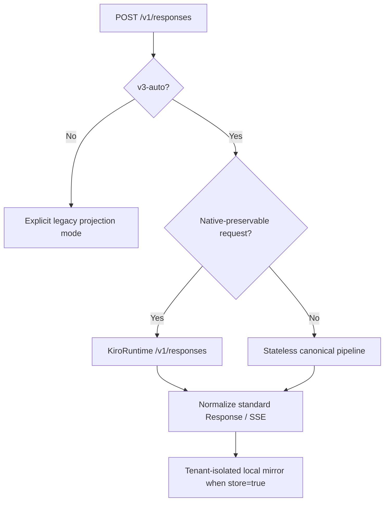

# V3 protocol compatibility

> **Author**: kiro-provider maintainers · **Date**: 2026-09-05 · **Version**: v3.0
> **Audience**: operators, client authors, and release reviewers

## TL;DR

V3 makes OpenAI Responses the primary public interface. The default
`v3-auto` mode sends ordinary requests to KiroRuntime's native
`POST /v1/responses` operation and automatically uses the mature stateless
pipeline for request shapes that the native operation cannot preserve.
Unsupported OpenAI capabilities return typed OpenAI error envelopes; they are
not silently discarded.

## Table of contents

- [1. Public HTTP surface](#1-public-http-surface)
- [2. V3 transport selection](#2-v3-transport-selection)
- [3. Native Responses lane](#3-native-responses-lane)
- [4. Stateless compatibility lane](#4-stateless-compatibility-lane)
- [5. Stored response lifecycle](#5-stored-response-lifecycle)
- [6. Request capability matrix](#6-request-capability-matrix)
- [7. Native-context decision](#7-native-context-decision)
- [8. Error and telemetry contract](#8-error-and-telemetry-contract)
- [9. Data-retention boundary](#9-data-retention-boundary)
- [10. Validation evidence](#10-validation-evidence)

## 1. Public HTTP surface

| Method and path | V3 behavior |
| --- | --- |
| `POST /v1/responses` | Streaming and non-streaming Responses creation. |
| `GET /v1/responses/{id}` | Retrieves the tenant-isolated local response mirror. |
| `DELETE /v1/responses/{id}` | Deletes the local mirror and blocks later gateway continuation. |
| `GET /v1/responses/{id}/input_items` | Cursor pagination with `after`, `limit` 1–100, and `order` defaulting to `desc`. |
| `POST /v1/responses/{id}/cancel` | Returns `response_not_cancellable` for mirrored terminal responses; background execution is not supported. |
| `POST /v1/responses/input_tokens` | Recognized route; returns HTTP 501 `unsupported_endpoint`. |
| `POST /v1/responses/compact` | Recognized route; returns HTTP 501 `unsupported_endpoint`. |
| `POST /v1/messages` | Anthropic Messages compatibility surface. |
| `POST /v1/messages/count_tokens` | Anthropic-compatible estimate with `x-kiro-token-count-mode: estimate`. |
| `POST /v1/chat/completions` | Legacy route, disabled unless `enable_legacy_chat_completions` is true. |

The official OpenAI Responses resource also defines create, retrieve, delete,
cancel, and input-item methods. V3 implements those core lifecycle shapes
locally because KiroRuntime exposes only native response creation and
continuation.

## 2. V3 transport selection



The stateless lane is selected for:

- `store: false`;
- `max` effort or a `-max` model variant;
- custom grammar tools and namespace tools;
- Codex `additional_tools`, `agent_message`, and namespaced call history;
- `parallel_tool_calls: false`;
- `include: ["reasoning.encrypted_content"]`.

If a request references a native stored response, it stays on the native lane.
A later request that would require switching that native lineage to the
stateless lane fails explicitly instead of weakening `store`, effort, tool, or
reasoning semantics.

## 3. Native Responses lane

The native lane calls:

```text
https://runtime.<region>.kiro.dev/v1/responses
```

Kiro CLI 2.21.1 uses the same KiroRuntime host. GPT Mantle routing is
server-side; the CLI does not call a separate public Mantle endpoint.

Verified native capabilities:

| Capability | GPT-5.6 Sol | Claude Opus 5 |
| --- | --- | --- |
| `instructions` | Supported | Supported |
| Standard Responses JSON and SSE | Supported | Supported |
| Function tools | Supported | Supported |
| `previous_response_id` | Supported with response/account affinity | Supported with response/account affinity |
| `max_output_tokens` | Supported | Supported |
| `reasoning.effort: xhigh` | Supported | Supported |
| `truncation: disabled` | Supported | Supported |
| `truncation: auto` | Supported | Rejected locally |
| `temperature` | Rejected locally | Supported |
| `top_p` | Rejected locally | Rejected locally |
| `max` effort | Routed to stateless lane | Routed to stateless lane |

Private upstream fields such as `billing` are removed. The public response
retains the requested model variant and normalized OpenAI fields.

## 4. Stateless compatibility lane

The fallback lane converts the request into the provider's canonical IR and
then uses the established CodeWhisperer/Kiro stream pipeline. It preserves:

- leading, intermediate, and trailing instruction order;
- non-empty text bytes, including whitespace-only input;
- images, inline documents, tool results, and their current-input boundary;
- function tools, custom grammar tools, and namespace identity through
  request-local private aliases;
- Codex collaboration `agent_message` content and author/recipient metadata;
- signed or redacted Kiro reasoning replay through tenant-bound `kr1_` tokens.

In `v3-auto`, this lane uses the explicit legacy instruction prefix only when
the native Responses lane cannot represent the request. It never moves a
trailing instruction suffix into earlier history or creates an empty current
user message.

> [!IMPORTANT]
> `parallel_tool_calls: false` is accepted for current Codex compatibility,
> but Kiro does not expose a protocol-level serial-tool guarantee. Clients
> requiring a hard provider-enforced serial guarantee must enforce it in their
> own tool scheduler.

## 5. Stored response lifecycle

V3 mirrors stored responses in the provider-owned SQLite database:

- tenant-isolated response and input-item JSON;
- 30-day TTL;
- 10,000-entry bounded retention;
- stable input-item IDs for cursor pagination;
- optional canonical request/completion state for stateless continuation;
- native response/account affinity for KiroRuntime continuation.

`previous_response_id` is accepted only when the referenced ID exists in the
same tenant mirror. Unknown, expired, cross-tenant, or locally deleted IDs
return HTTP 404 `response_not_found`.

`DELETE` removes only the gateway mirror. KiroRuntime returned HTTP 404 for
upstream retrieve, input-items, and delete probes, so V3 cannot prove or
request physical deletion of Kiro's server-side response state.

## 6. Request capability matrix

| Request feature | V3 contract |
| --- | --- |
| Text, message arrays, images, inline documents | Supported within documented Kiro format limits. |
| `instructions`, `system`, `developer` | Native on the ordinary V3 lane; ordered compatibility projection on stateless fallback. |
| Function tools | Native where possible; stateless fallback otherwise. |
| Custom grammar and namespace tools | Stateless fallback with public identity restored in responses. |
| `agent_message` | Stateless fallback; visible content is preserved, encrypted child metadata is not injected into the parent model. |
| `tool_choice: auto` / `none` | Supported where the request has no conflicting unfinished tool state. |
| Required, named, or constrained tool choice | Rejected. |
| `strict: true` | Rejected because Kiro cannot guarantee strict schema enforcement. |
| `store: true` / omitted | Supported with local mirroring. |
| `store: false` | Stateless lane; no local response mirror is written. |
| `previous_response_id` | Supported for locally mirrored native or stateless responses. |
| Responses `conversation` objects | Rejected with `unsupported_stateful_responses`. |
| Structured Outputs / JSON schema | Rejected with `unsupported_structured_output`. |
| Built-in Web Search, File Search, Computer Use, hosted MCP | Rejected; V3 does not fabricate hosted-tool events or citations. |
| Remote image URLs and OpenAI `file_id` references | Rejected; send data URLs or inline file data. |
| `background: true` | Rejected. |
| Prompt templates, moderation config, context management | Rejected. |
| `metadata`, `client_metadata`, `prompt_cache_key` | Accepted for response echo, tenant/session routing, or compatibility metadata; not presented as a Kiro cache guarantee. |
| `text.verbosity` | Accepted as compatibility metadata; Kiro exposes no verified verbosity control. |

## 7. Native-context decision

The older GenerateAssistantResponse API still has no generally available,
verified instruction channel:

- `additionalContext` failed instruction visibility and priority probes;
- the account feature response does not advertise `system_field_injection` or
  `system_prompt_migration`;
- the Amazon Q Developer settings page has no customer-visible switch for
  either feature.

Therefore:

- explicit `safe` remains fail-closed for instruction roles;
- `native-context-safe` uses `systemPrompt` only if the service advertises the
  required feature;
- default `v3-auto` obtains safe native instruction handling from the separate
  KiroRuntime CreateResponse `instructions` field.

There is no fixed deletion date for legacy projection. Removal remains
evidence-gated.

## 8. Error and telemetry contract

Responses and Chat errors use the OpenAI envelope and preserve `code` and
`param`. Anthropic errors use the Anthropic envelope.

Payload-free telemetry carries one `request_id` through:

1. request shape;
2. projection completion;
3. history construction;
4. every real SDK/native dispatch attempt;
5. completion witness;
6. terminal stream state.

Logs contain counts, enums, lengths, and hashes—not prompts, tool arguments,
credentials, reasoning signatures, replay tokens, or raw captures.

## 9. Data-retention boundary

`store: false` prevents the gateway from writing a local response mirror and
uses the stateless transport. It is not a claim of AWS Zero Data Retention.
KiroRuntime's native probe reported `store: true` even when sent
`store: false`, so V3 never sends that request shape through the native lane.

Temporary CLI interception artifacts and copied account databases are test
secrets. They must stay owner-only and be deleted after sanitized evidence is
preserved.

## 10. Validation evidence

The V3 candidate passed:

- 1,531 repository tests;
- TypeScript typecheck, lint, binary build, and `git diff --check`;
- isolated SQLite `PRAGMA integrity_check=ok`;
- native non-stream, standard SSE, function-tool, and
  `previous_response_id` probes;
- Codex CLI 0.153.0 connectivity, custom command execution, command-error
  recovery, and namespace collaboration (`spawn_agent`, child result, and
  `wait`) with no private alias leakage.

Detailed implementation and live-probe evidence:

- [V3 OpenAI Responses validation](audits/kiro-provider-v3-openai-responses-validation-2026-09-05.md)
- [Request projection optimization](audits/kiro-provider-projection-optimization-2026-09-05.md)
- [Audit index](audits/README.md)

Official OpenAI method references:

- [Create a response](https://developers.openai.com/api/reference/resources/responses/methods/create)
- [Retrieve a response](https://developers.openai.com/api/reference/resources/responses/methods/retrieve)
- [Delete a response](https://developers.openai.com/api/reference/resources/responses/methods/delete)
- [Cancel a response](https://developers.openai.com/api/reference/resources/responses/methods/cancel)
- [List input items](https://developers.openai.com/api/reference/resources/responses/subresources/input_items/methods/list)
