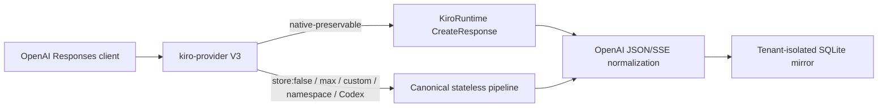

# kiro-provider V3 OpenAI Responses validation

> **Author**: kiro-provider maintainers · **Date**: 2026-09-05 · **Version**: v3.0
> **Audience**: release reviewers, operators, and provider integrators

## TL;DR

The V3 candidate is ready for release. It uses KiroRuntime's native OpenAI
Responses creation operation for ordinary requests, falls back to the
canonical stateless pipeline for unsupported native shapes, and implements a
tenant-isolated local response lifecycle. The compiled candidate passed 1,531
tests and a real Codex 0.153.0 multi-agent tool gate.

## Table of contents

- [1. Scope](#1-scope)
- [2. Kiro CLI and runtime findings](#2-kiro-cli-and-runtime-findings)
- [3. Implemented V3 architecture](#3-implemented-v3-architecture)
- [4. OpenAI Responses lifecycle](#4-openai-responses-lifecycle)
- [5. Codex compatibility](#5-codex-compatibility)
- [6. Native-context decision](#6-native-context-decision)
- [7. Model and effort findings](#7-model-and-effort-findings)
- [8. Validation gates](#8-validation-gates)
- [9. Release decisions](#9-release-decisions)

## 1. Scope

This work was performed in the isolated worktree
`/tmp/kiro-provider-native-context-safe`. Production port 8787, the installed
v0.8.1 binary, and the production account database were not modified.

The V3 goal was independent of the earlier safe-mode design:

- provide a usable OpenAI Responses provider;
- use current Kiro CLI/KiroRuntime behavior as primary evidence;
- preserve explicit errors when Kiro cannot implement an OpenAI capability;
- validate against a standard Codex Responses client without depending on
  Zuno.

## 2. Kiro CLI and runtime findings

### 2.1 Client and endpoint

| Item | Evidence |
| --- | --- |
| Kiro CLI | 2.21.1 |
| Kiro CLI SHA-256 | `6880acd76a902afb4f0ba3c5d29134e6608c0b359632227105d08a0756357e21` |
| Kiro agent service | KAS 0.58.7 |
| Runtime host | `runtime.<region>.kiro.dev` |
| Native operation | `POST /v1/responses` |
| Routing conclusion | Mantle model routing is server-side behind KiroRuntime, not a separate CLI endpoint. |

The private KAS Smithy model exposes a CreateResponse operation whose request
shape maps to the core OpenAI fields: model, input, instructions, tools,
tool choice, streaming, output-token limit, sampling controls, truncation,
reasoning, and previous response ID.

### 2.2 Live endpoint probes

| Probe | Result |
| --- | --- |
| Native non-stream Response | HTTP 200, standard OpenAI `response` object |
| Native stream | HTTP 200, standard Responses SSE event sequence |
| Function tool | HTTP 200, `function_call` output |
| `previous_response_id` | HTTP 200 and correct prior marker |
| Native retrieve / input-items / delete | HTTP 404 |
| `/responses/input_tokens` | HTTP 200 Smithy error wrapper, not an OpenAI token-count object |
| `/responses/compact` | HTTP 200 Smithy error wrapper, not an OpenAI compaction object |
| `store: false` on native endpoint | Response still reported `store: true` |

The two extended-method probes returned the identical 160-byte
`Output{__type,message}/Version` structure. They are not portable OpenAI
operations, so V3 recognizes both public paths and returns a typed HTTP 501
instead of forwarding the misleading wrapper.

## 3. Implemented V3 architecture



### 3.1 Native transport

- account selection, refresh, model availability, proxy, and per-account
  queue ownership;
- one forced credential refresh after HTTP 401/403;
- local rate-limit marking after HTTP 429;
- model-variant effort mapping;
- private-field removal and public model restoration;
- frame-safe SSE normalization, including terminal frames without a trailing
  blank line;
- response/account affinity for native continuation.

### 3.2 Stateless compatibility transport

- exact trailing-instruction boundary repair;
- `store:false` without local response storage;
- `max` effort;
- custom grammar tools;
- namespace tool aliases restored to public identity;
- Codex `additional_tools` and `agent_message`;
- child encrypted metadata excluded from parent model input;
- signed/redacted reasoning replay with existing account/model/conversation
  binding.

### 3.3 Fail-closed transport switching

A native stored response cannot later switch to a stateless-only request
shape. V3 rejects native continuations that request:

- `store:false`;
- `parallel_tool_calls:false`;
- `max` effort;
- encrypted reasoning replay;
- custom/namespace/agent-only input forms.

This prevents a successful request from silently weakening the client's
storage, effort, or tool contract.

## 4. OpenAI Responses lifecycle

The provider-owned SQLite schema now stores:

- normalized Response JSON;
- normalized input items with stable IDs;
- canonical request/completion state for stateless continuation;
- 30-day expiry and 10,000-entry bounded cleanup.

Implemented methods:

| Method | Implementation |
| --- | --- |
| Create | Native or stateless V3 transport |
| Retrieve | Local mirror |
| Delete | Local mirror only |
| Cancel | Typed rejection for terminal mirrored responses |
| List input items | `after`, `limit`, `order`; default `desc` |

Local deletion blocks gateway retrieval and continuation. It does not claim
physical deletion from Kiro because KiroRuntime exposes no working delete
method.

## 5. Codex compatibility

The real-client gate used:

- Codex CLI 0.153.0;
- GPT-5.6 Sol with xhigh reasoning;
- isolated `CODEX_HOME` and SQLite state;
- isolated request capture proxy;
- a copied SQLite account snapshot with `PRAGMA integrity_check=ok`;
- fresh loopback ports.

Results:

| Gate | Result |
| --- | --- |
| Connectivity / standard Response | Pass |
| Custom command and exact file side effect | Pass |
| Failed command followed by recovery command | Pass |
| Namespace `spawn_agent` | Pass |
| Child sentinel delivered through `agent_message` | Pass |
| Namespace `wait` completion | Pass |
| Private `kiro_custom_*` / `kiro_ns_*` leakage | None |

The final namespace pass completed on the first bounded attempt.

## 6. Native-context decision

### 6.1 Old GenerateAssistantResponse path

- Native `additionalContext` failed 0/5 instruction fidelity cases.
- The account feature response did not advertise `system_field_injection` or
  `system_prompt_migration`.
- The Amazon Q Developer settings page and its loaded application bundles had
  no customer-visible switch for either feature.

`safe` therefore remains fail-closed. `native-context-safe` may use
`systemPrompt` only after the service advertises the feature.

### 6.2 V3 path

KiroRuntime CreateResponse exposes a working native `instructions` field.
This is the V3 native-context solution and does not depend on the old private
feature gate.

## 7. Model and effort findings

The earlier 72-cell Responses AB/BA study remains authoritative:

- GPT-5.6 Sol quality passed 36/36; xhigh did not meet the 15% median-time and
  70% paired-win gates against max.
- Claude Opus 5 quality passed 34/36; the zero-quality-regression gate failed.
- SDK dispatch medians were one for both efforts.

Decision: do not globally remap max and xhigh. V3 routes max through the
stateless transport because native KiroRuntime rejects it.

## 8. Validation gates

```bash
bun test
bun run lint
bun run typecheck
bun run build:binary
git diff --check
```

Results:

- tests: 1,531 passed, 0 failed;
- lint: passed;
- TypeScript: passed;
- binary build: passed;
- `git diff --check`: passed;
- candidate binary SHA-256:
  `2cb2a3948f59a35eb631ac8fc9b3fa58ed256907ac7c4fe1d740ab587bf11838`.

After the final live gates, the raw MITM flows, temporary CA files, copied
account database, and isolated E2E response directory were deleted. Only the
sanitized repository reports remain.

## 9. Release decisions

| Topic | Decision |
| --- | --- |
| V3 release | Approved after CI and release artifact verification |
| Default projection mode | `v3-auto` |
| Native instructions | Use CreateResponse `instructions` |
| Old `safe` mode | Keep fail-closed |
| `native-context-safe` | Feature-advertisement gated |
| `store:false` | Stateless only |
| `previous_response_id` | Supported through tenant-local mirrors |
| Compact / exact input tokens | Explicit HTTP 501 |
| max versus xhigh | No global recommendation change |
| CLI portability | Core CreateResponse behavior is portable; extended methods are not |

Related records:

- [V3 protocol compatibility](../PROTOCOL_COMPATIBILITY.md)
- [Projection optimization](kiro-provider-projection-optimization-2026-09-05.md)
- [Audit index](README.md)
