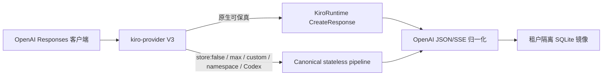

# kiro-provider V3 OpenAI Responses 验证报告

> **作者**：kiro-provider 维护者 · **日期**：2026-09-05 · **版本**：v3.0
> **受众**：发布评审、运维人员与 Provider 集成开发者

## TL;DR

V3 候选已具备发版条件。普通请求使用 KiroRuntime 原生 OpenAI Responses
创建操作；原生无法保真的形态自动 fallback 到 canonical stateless pipeline；
同时实现按租户隔离的本地 Response 生命周期。编译候选通过 1,531 个测试和
Codex 0.153.0 真实多代理工具门禁。

## 目录

- [1. 范围](#1-范围)
- [2. Kiro CLI 与 runtime 发现](#2-kiro-cli-与-runtime-发现)
- [3. V3 实现架构](#3-v3-实现架构)
- [4. OpenAI Responses 生命周期](#4-openai-responses-生命周期)
- [5. Codex 兼容验证](#5-codex-兼容验证)
- [6. Native-context 结论](#6-native-context-结论)
- [7. 模型与 effort 结论](#7-模型与-effort-结论)
- [8. 验证门禁](#8-验证门禁)
- [9. 发版决策](#9-发版决策)

## 1. 范围

本轮在隔离 worktree `/tmp/kiro-provider-native-context-safe` 中完成。生产端口
8787、已安装的 v0.8.1 二进制与生产账号数据库均未修改。

V3 目标独立于旧 safe-mode 设计：

- 提供实际可用的 OpenAI Responses Provider；
- 以当前 Kiro CLI/KiroRuntime 行为作为主要证据；
- Kiro 无法实现的 OpenAI 能力必须明确报错；
- 使用标准 Codex Responses 客户端验证，不依赖 Zuno。

## 2. Kiro CLI 与 runtime 发现

### 2.1 客户端与端点

| 项目 | 证据 |
| --- | --- |
| Kiro CLI | 2.21.1 |
| Kiro CLI SHA-256 | `6880acd76a902afb4f0ba3c5d29134e6608c0b359632227105d08a0756357e21` |
| Kiro agent service | KAS 0.58.7 |
| Runtime host | `runtime.<region>.kiro.dev` |
| 原生操作 | `POST /v1/responses` |
| 路由结论 | Mantle 模型路由位于 KiroRuntime 服务端，不是独立 CLI 端点。 |

KAS 私有 Smithy model 中的 CreateResponse 请求结构映射到核心 OpenAI 字段：
model、input、instructions、tools、tool choice、stream、output token 上限、
sampling、truncation、reasoning 与 previous response ID。

### 2.2 真实端点探针

| 探针 | 结果 |
| --- | --- |
| 原生非流式 Response | HTTP 200，标准 OpenAI `response` 对象 |
| 原生流 | HTTP 200，标准 Responses SSE 事件序列 |
| Function 工具 | HTTP 200，返回 `function_call` |
| `previous_response_id` | HTTP 200，并正确恢复前一 marker |
| 原生 retrieve / input-items / delete | HTTP 404 |
| `/responses/input_tokens` | HTTP 200 Smithy 错误包装，不是 OpenAI token-count 对象 |
| `/responses/compact` | HTTP 200 Smithy 错误包装，不是 OpenAI compaction 对象 |
| 原生 `store: false` | 返回仍报告 `store: true` |

两个扩展方法都返回相同的 160 字节
`Output{__type,message}/Version` 结构，不能作为 OpenAI 操作移植。因此 V3
识别这两个公开路径，并返回带类型的 HTTP 501，而不是透传误导性包装。

## 3. V3 实现架构



### 3.1 原生传输

- 账号选择、token 刷新、模型可用性、代理与每账号队列所有权；
- HTTP 401/403 后最多一次强制刷新；
- HTTP 429 后记录本地 rate limit；
- 模型变体 effort 映射；
- 私有字段删除与公开模型名恢复；
- 帧边界安全的 SSE 归一化，包括没有尾部空行的 terminal frame；
- 原生续轮所需的 Response/账号亲和。

### 3.2 Stateless 兼容传输

- 精确尾部指令边界修复；
- 不写本地 Response 状态的 `store:false`；
- `max` effort；
- custom grammar 工具；
- namespace 私有别名恢复为公开身份；
- Codex `additional_tools` 与 `agent_message`；
- 子代理加密元数据不注入父模型；
- 沿用账号/模型/conversation 绑定的签名或 redacted reasoning 回放。

### 3.3 默认拒绝的传输切换

原生已存储 Response 不能在后续请求中切换到只支持 stateless 的形态。V3 会
拒绝以下原生续轮请求：

- `store:false`；
- `parallel_tool_calls:false`；
- `max` effort；
- 加密 reasoning replay；
- custom、namespace 或 agent-only 输入。

这样不会在请求成功的同时偷偷弱化客户端的存储、effort 或工具契约。

## 4. OpenAI Responses 生命周期

Provider 自有 SQLite 现在保存：

- 归一化 Response JSON；
- 带稳定 ID 的归一化 input item；
- stateless 续轮所需 canonical request/completion；
- 30 天过期与最多 10,000 条的有界清理。

已实现方法：

| 方法 | 实现 |
| --- | --- |
| Create | 原生或 stateless V3 传输 |
| Retrieve | 本地镜像 |
| Delete | 仅本地镜像 |
| Cancel | 对已终止镜像返回带类型错误 |
| List input items | `after`、`limit`、`order`，默认 `desc` |

删除本地镜像会阻止网关读取与续轮，但不宣称 Kiro 已物理删除上游状态，因为
KiroRuntime 没有可用 delete 方法。

## 5. Codex 兼容验证

真实客户端门禁使用：

- Codex CLI 0.153.0；
- GPT-5.6 Sol xhigh；
- 隔离 `CODEX_HOME` 与 SQLite 状态；
- 隔离 request capture proxy；
- `PRAGMA integrity_check=ok` 的账号库副本；
- 全新 loopback 端口。

结果：

| 门禁 | 结果 |
| --- | --- |
| 连通与标准 Response | 通过 |
| Custom command 与精确文件副作用 | 通过 |
| 命令失败后的恢复命令 | 通过 |
| Namespace `spawn_agent` | 通过 |
| 通过 `agent_message` 返回子代理 sentinel | 通过 |
| Namespace `wait` 完成 | 通过 |
| 私有 `kiro_custom_*` / `kiro_ns_*` 泄漏 | 无 |

最终 namespace 门禁在第一次有界尝试中完成。

## 6. Native-context 结论

### 6.1 旧 GenerateAssistantResponse 路径

- 原生 `additionalContext` 在 5 个指令保真案例中通过 0 个；
- 当前账号 feature response 未公开 `system_field_injection` 或
  `system_prompt_migration`；
- Amazon Q Developer 设置页及其加载的应用 bundle 没有这两个 feature 的
  客户可见开关。

因此 `safe` 继续默认拒绝；`native-context-safe` 只有服务端公开 feature 后才
使用 `systemPrompt`。

### 6.2 V3 路径

KiroRuntime CreateResponse 提供可用的原生 `instructions` 字段。它是 V3 的
native-context 解决方案，不依赖旧私有 feature gate。

## 7. 模型与 effort 结论

此前 72-cell Responses AB/BA 研究继续作为权威结论：

- GPT-5.6 Sol 质量 36/36；xhigh 相比 max 未达到 15% 中位时间改善与 70%
  配对胜率门槛；
- Claude Opus 5 质量 34/36，未通过质量零退化门槛；
- 两种 effort 的 SDK dispatch 中位数均为 1。

决策：不做 max/xhigh 全局重映射。KiroRuntime 原生端点拒绝 max，因此 V3
通过 stateless 传输承载 max。

## 8. 验证门禁

```bash
bun test
bun run lint
bun run typecheck
bun run build:binary
git diff --check
```

结果：

- 测试：1,531 通过，0 失败；
- lint：通过；
- TypeScript：通过；
- binary build：通过；
- `git diff --check`：通过；
- 候选二进制 SHA-256：
  `2cb2a3948f59a35eb631ac8fc9b3fa58ed256907ac7c4fe1d740ab587bf11838`。

最终真实门禁结束后，原始 MITM flow、临时 CA、账号数据库副本与隔离 E2E
响应目录均已删除；只保留仓库中的脱敏报告。

## 9. 发版决策

| 主题 | 决策 |
| --- | --- |
| V3 发版 | CI 与发布制品验证后批准 |
| 默认投影模式 | `v3-auto` |
| 原生指令 | 使用 CreateResponse `instructions` |
| 旧 `safe` | 继续默认拒绝 |
| `native-context-safe` | 由 feature advertisement 门控 |
| `store:false` | 只走 stateless |
| `previous_response_id` | 通过租户本地镜像支持 |
| Compact / 精确 input tokens | 明确 HTTP 501 |
| max 与 xhigh | 不改变全局建议 |
| CLI 可移植性 | 核心 CreateResponse 可移植；扩展方法不可移植 |

相关记录：

- [V3 协议兼容范围](../readme/PROTOCOL_COMPATIBILITY.zh.md)
- [请求投影优化](kiro-provider-projection-optimization-2026-09-05.zh.md)
- [审计索引](README.md)
