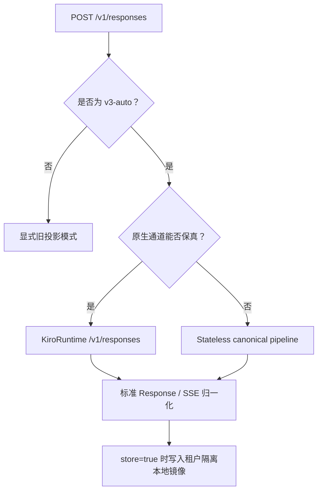

# V3 协议兼容范围

> **状态**：当前 V3 契约
> **受众**：运维人员、客户端开发者与发布评审者

## TL;DR

V3 将 OpenAI Responses 作为主要公开接口。默认 `v3-auto` 会把普通请求发送到
KiroRuntime 原生 `POST /v1/responses`，当原生操作无法保真承载请求时，自动
切换到成熟的 stateless pipeline。不支持的 OpenAI 能力会返回带类型的 OpenAI
错误 envelope，不会被静默丢弃。

## 目录

- [1. 公开 HTTP 接口](#1-公开-http-接口)
- [2. V3 传输选择](#2-v3-传输选择)
- [3. 原生 Responses 通道](#3-原生-responses-通道)
- [4. Stateless 兼容通道](#4-stateless-兼容通道)
- [5. Response 状态生命周期](#5-response-状态生命周期)
- [6. 请求能力矩阵](#6-请求能力矩阵)
- [7. Native-context 结论](#7-native-context-结论)
- [8. 错误与遥测契约](#8-错误与遥测契约)
- [9. 数据保留边界](#9-数据保留边界)
- [10. 验证证据](#10-验证证据)
- [11. 保真控制与验证边界](#11-保真控制与验证边界)

## 1. 公开 HTTP 接口

| 方法与路径                           | V3 行为                                                               |
| ------------------------------------ | --------------------------------------------------------------------- |
| `POST /v1/responses`                 | 创建流式或非流式 Response。                                           |
| `GET /v1/responses/{id}`             | 读取租户隔离的本地 Response 镜像。                                    |
| `DELETE /v1/responses/{id}`          | 删除本地镜像，并阻止后续网关续轮。                                    |
| `GET /v1/responses/{id}/input_items` | 支持 `after`、`limit` 1–100 与 `order`；默认 `desc`。                 |
| `POST /v1/responses/{id}/cancel`     | 对已终止镜像返回 `response_not_cancellable`；不支持 background 执行。 |
| `POST /v1/responses/input_tokens`    | 识别该路径，但返回 HTTP 501 `unsupported_endpoint`。                  |
| `POST /v1/responses/compact`         | 识别该路径，但返回 HTTP 501 `unsupported_endpoint`。                  |
| `POST /v1/messages`                  | Anthropic Messages 兼容接口。                                         |
| `POST /v1/messages/count_tokens`     | Anthropic 兼容估算，并返回 `x-kiro-token-count-mode: estimate`。      |
| `POST /v1/chat/completions`          | 旧接口；只有开启 `enable_legacy_chat_completions` 才可用。            |

OpenAI 官方 Responses 资源还定义了 create、retrieve、delete、cancel 与 input
items 方法。KiroRuntime 只提供原生创建与续轮，因此 V3 在本地实现其余核心
生命周期结构。

### Anthropic Messages / Claude Code 边界

Claude Code 2.1.270 已针对 stateless canonical 通道验证。适配器接受当前文本、
图片、标准工具/结果、中途 system、adaptive thinking、effort、temperature、
cache hint 与无损 context management 形状。`thinking.display: "omitted"` 使用
绑定 TTL、租户、模型、完整输出以及 mint 协议/区域/profile/operation 的
`kr2_` token 作为 opaque Anthropic signature，在不暴露 thinking 文本的前提下
恢复原始 Kiro signed reasoning；历史 `kr1_` 仍可读但保持 owner-bound，Claude
空文本签名也会保留。Cache marker 仍是性能提示：
`x-kiro-prompt-cache-mode` 返回 `server-auto`、`explicit-checkpoints` 或 `off`；
只映射上游实测 cache read/write，未知 bucket 返回 `null`，不再伪造为零。Messages 的 omitted thinking 与 Responses 共用 verified 账号故障切换门控；
当前只开放带认证来源证据、由带 profile 的 KiroRuntime
`GenerateAssistantResponse` 在 `us-east-1` 铸造的 Claude Sonnet 5 signed text。

`context_management` 仅接受 `clear_thinking_20251015` 且 `keep: "all"`，
并返回 `applied_edits: []`。Destructive edits、有界 `single-string-object-v1`
profile 之外的 Structured Outputs（见第 4 节的 Anthropic Messages 变体）、强制/串行
工具控制以及未知语义字段继续以 `invalid_request_error` 明确失败。流式响应维持
Anthropic block 顺序，并在静默期发送 `ping`。`x-claude-code-session-id` 只作为
租户隔离的 affinity key 使用，不记录原文。

GPT-5.6 Sol/Terra/Luna 的 Anthropic `max_tokens` 默认继续 fail closed。调用方
只有显式发送 `x-kiro-output-token-limit-mode: advisory` 才会进入兼容路径；且仅
这三个 GPT wire model 会在调用 Kiro 前省略 Claude Code 的必填 limit，在响应中
返回 `advisory-unenforced` 并记录结构化审计事件。该例外不改变 OpenAI 接口或
已经探针确认的 Claude `max_tokens` 投影。Claude Code 2.1.263 使用
`modelPicker.behavesAs` 为 GPT 行提供 effort/xhigh/max UI，产生的
`output_config.effort` 再转换为 Kiro GPT `reasoning.effort`。

## 2. V3 传输选择



以下请求自动选择 stateless 通道：

- `store: false`；
- 按显式参数、模型后缀和配置归一化后，生效值为 `max` 的 effort；
- custom grammar 与尚未验证的原生工具桥接组合；
- Codex `additional_tools` 与 `agent_message`；
- 存在可调用工具时的 `parallel_tool_calls: false`；
- `include: ["reasoning.encrypted_content"]`，或 input 中带有 Provider `kr1_` 或 `kr2_` token；
- compatible 模式下由 Provider 本地执行的 `single-string-object-v1` profile。

引用原生已存储 Response 的请求会继续使用原生通道。如果新请求要求把该原生
lineage 切换到 stateless 通道，V3 会明确报错，不会弱化 `store`、effort、
工具或 reasoning 语义。

## 3. 原生 Responses 通道

原生通道调用：

```text
https://runtime.<region>.kiro.dev/v1/responses
```

Kiro CLI 2.21.1 使用同一个 KiroRuntime host。GPT Mantle 路由发生在服务端，
CLI 不会直接调用另一个公开 Mantle 端点。

已验证原生能力：

| 能力                       | GPT-5.6 Sol                                | Claude Opus 5                                 |
| -------------------------- | ------------------------------------------ | --------------------------------------------- |
| `instructions`             | 支持                                       | 原样转发；us-east-1 的优先级仍未通过验证      |
| 标准 Responses JSON 与 SSE | 支持                                       | 支持                                          |
| Function 工具              | 支持                                       | 支持                                          |
| `previous_response_id`     | 绑定持久归属；受影响的 opaque 历史精确回放 | us-east-1 中恢复完整历史后调用 CreateResponse |
| `max_output_tokens`        | 支持                                       | 支持                                          |
| `reasoning.effort: xhigh`  | 支持                                       | 支持                                          |
| `truncation: disabled`     | 支持                                       | 支持                                          |
| `truncation: auto`         | 支持                                       | 本地拒绝                                      |
| `temperature`              | 本地拒绝                                   | 支持                                          |
| `top_p`                    | 本地拒绝                                   | 本地拒绝                                      |
| `max` effort               | 切换 stateless                             | 切换 stateless                                |

Provider 会删除 `billing` 等私有上游字段，并在公开响应中保留客户端请求的模型
变体与归一化 OpenAI 字段。

## 4. Stateless 兼容通道

Fallback 通道先把请求转换为 Provider canonical IR，再使用既有
CodeWhisperer/Kiro 流式管道。它保留：

- 开头、中间与尾部指令的顺序；
- 任意非空文本字节，包括纯空白输入；
- 图片、内联文档、工具结果及其 current-input 边界，包括从 function/custom 工具结果
  提升一个内联图片块，同时保留相邻文本和工具关联；
- function、custom grammar 与 namespace 工具，并通过请求内私有别名恢复公开身份；
- Codex 协作 `agent_message` 的可见内容与 author/recipient 元数据；
- 通过绑定 TTL、租户、模型、完整输出与 mint 来源证据的 `kr2_` token 回放 Kiro 签名或 redacted reasoning；历史 `kr1_` 仅 owner-bound 读取。
- 修复旧版 Claude Code 历史中同一 assistant 轮次含多个不同空 direct `thinking` 块的情况：省略全部歧义 replay 信封，但保留可见 assistant/tool 历史；兼容损失通过 `x-kiro-reasoning-replay-mode: conflict-omitted` 与脱敏审计事件明确暴露。
- 当前客户端撤下 `TaskOutput` 等工具后，继续保留完整 Messages 工具历史。历史声明不授权新调用；本轮允许哪些工具及参数，只由当前 `tools` 和 schema 决定。

Fable Messages 启用 thinking 且实际 `display: omitted` 时，若上游前缀含多个
不同的 signature-only reasoning 事件，Provider 可整组省略。Provider 在
`message_start` 前检查完整前缀，最多 128 个事件、1 MiB，然后继续原生成而不重试。
被省略的 reasoning 不产生 thinking 块、replay capture、数据库记录或
`kr1_`/`kr2_` token。响应携带
`x-kiro-reasoning-replay-mode: conflict-omitted`；
`anthropic_output_reasoning_conflict_omitted` 审计只含模型、方向、数量和字节长度，
不包含签名或签名哈希。

完全相同的重复签名仍按正常方式回放。非空、redacted、混合、超限或晚到冲突继续
拒绝，其他模型或显式 `display: summarized` 的冲突也不降级。提交前可返回
HTTP 502；提交后通过 SSE error 终止，不发成功终态。默认 Fable effective omitted
不会改变正常情况下默认返回原生签名、显式 omitted 返回 Provider token 的区别。

撤销工具会保留其可见历史，但仍可能改变上游签名前缀。跨账号回放支持不意味着
任意 system/tools/历史变化都兼容；应保留原签名上下文，或将可见任务状态交接到新会话。

在 `v3-auto` 中，只有原生 Responses 通道不能承载请求时，该通道才使用显式
legacy 指令前缀。它不会把尾部指令移入更早历史，也不会构造空 current user。

> [!IMPORTANT]
> 为兼容当前 Codex，V3 接受 `parallel_tool_calls: false`，但 Kiro 没有提供
> 协议级“只允许串行工具调用”的保证。需要硬性串行保证的客户端应在自己的
> 工具调度器中执行约束。

### 有界的本地 structured-output profile

`responses_fidelity_mode: "compatible"` 只放行一个由 Provider 本地执行的
`single-string-object-v1` profile。识别完全依据协议结构：`strict:true` 的
`json_schema`，根 object 恰好一个 required string 字段，
`additionalProperties:false`，并同时包含安全整数 `minLength`/`maxLength`，满足
`1 <= minLength <= maxLength <= 256`。format name 只允许最多 64 个 ASCII
字母、数字、`_`、`-`；属性名使用最多 64 字符的标识符形状，并拒绝
`__proto__`、`prototype`、`constructor`。未知关键字、JSON mode、引用、组合、
enum、pattern、default、嵌套 object 和 array 全部拒绝。

请求必须是一次性、纯文本元数据生成：`store` 省略或 false，不能有
`previous_response_id`、`conversation`、工具调用/结果历史、reasoning replay、图片、
文件、agent message 或 `background:true`。当前 `tools` 与 `additional_tools` 声明
经既有校验后完整投影，包括 Codex 自动标题线程附带的 collaboration namespace。
任何本轮工具调用都会在公开前被拒绝，即使它已经声明。识别不会查看 User-Agent、
`client_metadata`、模型、prompt 文字、cwd、originator，也不会匹配 Schema name
是否含 title。省略的 `store` 会本地归一为 false，并作为兼容损失报告。

Kiro 上游仍生成普通 visible text。Provider 在内部最多缓冲 64 KiB UTF-8，构造
单字段 JSON envelope，并经 AJV 最终验证后才公开 output text；流式客户端不会先
看到裸模型 delta。该请求最多允许一次上游模型派发，验证失败不会触发修复推理或
自动重试。Response usage 保留真实上游值，本地增加的 JSON 语法不伪装成模型 token。
成功和失败 Response state 都回显原始 `text.format`。

这不是通用 Structured Outputs 支持，也不能证明 Kiro 上游原生执行 JSON Schema。
复杂 Schema、`json_object`、工具执行/历史、continuation/stateful 请求和
`responses_fidelity_mode:"strict"` 继续 fail closed。compatible 响应通过
`structured_output_locally_enforced` 报告本地执行；流式再报告
`structured_output_stream_buffered`；省略 `store` 再报告
`structured_output_store_defaulted_false`；携带工具声明时再报告
`structured_output_tool_calls_rejected`。

#### Anthropic Messages 变体

`POST /v1/messages` 从顶层 `output_config.format` 识别同一个
`single-string-object-v1` profile，该字段必须恰好是
`{ type: "json_schema", schema }`；Anthropic 的形状没有 `name` 或 `strict`，出现
任何其他键都会被拒绝。Schema 边界完全相同：根 object 恰好一个 required string
属性、`additionalProperties: false`、标识符形状且不是 `__proto__`、`prototype`、
`constructor` 的属性名，以及可选的整数 `minLength`/`maxLength`，满足
`1 <= minLength <= maxLength <= 256`（省略时默认为 1 和 256）。这正是 Claude Code
2.1.280 生成会话标题时发送的形状。请求边界要求 `thinking` 省略或为
`{ type: "disabled" }`，`tool_choice` 省略、`auto` 或 `none`；可以声明工具，但任何
上游工具调用都会在公开前被拒绝。流式与非流式请求都接受，`output_config.effort`
与 `format` 同时出现时保持既有投影。适配器在上游投影中剥离 `format`：不会有
Schema、注入的 prompt 或第二次推理到达 Kiro。

发布流程与 Responses 通道一致。Provider 最多缓冲 64 KiB 上游文本，归一为单属性
JSON envelope（去除首尾空白、剥掉包住整段输出的单个 Markdown 代码围栏、按
`maxLength` 个 code point 截断，上游若返回带同名属性的 JSON object 或 JSON string
则归一而不二次包装），经 AJV 验证后才发布恰好
一个 text block（流式为 `content_block_start`、一个 `text_delta`、
`content_block_stop`），`stop_reason` 为 `end_turn`，usage 为真实上游值，并带响应头
`x-kiro-structured-output: single-string-object-v1`。其他任何
`output_config.format` 返回 `400 invalid_request_error`，code 为
`unsupported_structured_output`，`param` 为 `output_config.format`；边界违规使用
同一 code 并在 `param` 中指出违规字段。发布失败返回 `502 api_error`，code 为
`structured_output_validation_failed`、`structured_output_buffer_exceeded`、
`structured_output_unexpected_tool_call` 或
`structured_output_unexpected_reasoning`；流已提交后则变为携带同一 code 的 SSE
`error` 事件，且永不发布部分文本。识别时记录只含哈希与计数的审计事件
`anthropic_structured_output_enforced`；失败时记录只含 code 的
`anthropic_structured_output_failed`。其他 `output_config` 键仍返回
`unsupported_parameter`，message 级 `output_config` 仍返回
`unsupported_message_field`。`responses_fidelity_mode` 不控制该变体：它只作用于
Responses 通道，而 Messages 没有备选通道，因此该 profile 在 Messages 上始终可用。

## 5. Response 状态生命周期

V3 在 Provider 自有 SQLite 中镜像已存储 Response：

- 按租户隔离的 Response 与 input item JSON；
- 30 天 TTL；
- 最多 10,000 条的有界保留；
- 用于 cursor 分页的稳定 input item ID；
- stateless 续轮所需的逻辑 item 快照和私有 replay 附件；
- 原生续接的账号、区域、profile 持久绑定；亲和缓存仅用于加速。

当前 us-east-1 的 Opus 5、Sonnet 5 原生 previous ID 未恢复历史，因此 Provider
恢复完整 wire 历史后调用 CreateResponse。已验证范围内，Sol 的 opaque reasoning
历史也采用精确回放；其他 GPT 历史保留上游续接。手动传回 native opaque token 时，
从同租户持久记录恢复归属，不猜测账号。读取器兼容 V1/V2，
新的 V3 快照使本地回放不依赖祖先镜像仍然存在。

只有同一租户镜像中存在的 ID 才能作为 `previous_response_id`。未知、过期、
跨租户或本地已删除的 ID 返回 HTTP 404 `response_not_found`。

`DELETE` 只删除网关本地镜像。KiroRuntime 的 retrieve、input-items 与 delete
真实探针均返回 HTTP 404，因此 V3 无法证明或请求 Kiro 服务端物理删除。

## 6. 请求能力矩阵

| 请求能力                                             | V3 契约                                                                                                              |
| ---------------------------------------------------- | -------------------------------------------------------------------------------------------------------------------- |
| 文本、消息数组、图片、内联文档                       | 在已记录的 Kiro 格式限制内支持；function/custom 工具结果可携带一个内联 data-URL 图片块。                             |
| `instructions`、`system`、`developer`                | 普通 V3 通道使用原生字段；stateless fallback 保序投影。                                                              |
| Function 工具                                        | 能走原生时走原生，否则 fallback。                                                                                    |
| Namespace 与自由文本 custom 工具                     | 已验证的模型/区域使用原生桥接；其他组合使用兼容路径。Grammar 工具保留兼容路径。                                      |
| `agent_message`                                      | Stateless fallback；保留可见内容，不把子代理加密元数据注入父模型。                                                   |
| `tool_choice: auto` / `none`                         | 在不存在冲突的未完成工具状态时支持。                                                                                 |
| Required、指定或受约束 tool choice                   | 拒绝。                                                                                                               |
| `strict: true`                                       | 仅上述 compatible 模式有界本地 profile 接受；其他 strict JSON Schema 请求拒绝。                                      |
| `store: true` / 省略                                 | 普通请求支持镜像；本地 profile 拒绝 true，省略时归一为 false 并报告兼容损失。                                        |
| `store: false`                                       | 走 stateless，不写本地 Response 镜像。                                                                               |
| `previous_response_id`                               | 支持本地镜像中的原生或 stateless Response。                                                                          |
| Responses `conversation` 对象                        | 返回 `unsupported_stateful_responses`。                                                                              |
| Structured Outputs / JSON schema                     | 仅本地执行 `single-string-object-v1`：Responses 在 compatible 模式下从 strict `text.format` 识别，Messages 从 `output_config.format` 识别且不受保真模式限制；任意复杂 Schema 与 JSON mode 返回 `unsupported_structured_output`。 |
| 内置 Web Search、File Search、Computer Use、托管 MCP | 拒绝；V3 不伪造托管工具或引用事件。                                                                                  |
| 远程图片 URL 与 OpenAI `file_id`                     | 拒绝；应发送 data URL 或内联文件数据。                                                                               |
| `background: true`                                   | 拒绝。                                                                                                               |
| Prompt template、moderation、context management      | 拒绝。                                                                                                               |
| `metadata`、`client_metadata`、`prompt_cache_key`    | 用于响应回显、租户/会话路由或兼容元数据；不宣称等价于 Kiro prompt cache。                                            |
| `text.verbosity`                                     | 作为兼容元数据接受；Kiro 没有经过验证的 verbosity 控制。                                                             |

## 7. Native-context 结论

旧 GenerateAssistantResponse API 仍没有普遍可用且经过验证的指令通道：

- `additionalContext` 没有通过指令可见性与优先级探针；
- 当前账号 feature response 未公开 `system_field_injection` 或
  `system_prompt_migration`；
- Amazon Q Developer 设置页没有这两个 feature 的客户可见开关。

因此：

- 显式 `safe` 对指令角色继续默认拒绝；
- `native-context-safe` 只有在服务端公开所需 feature 后才使用
  `systemPrompt`；
- 默认 `v3-auto` 使用独立 KiroRuntime CreateResponse 的 `instructions`
  字段实现安全原生指令。

Legacy 投影没有固定删除日期，移除继续采用证据门控。

## 8. 错误与遥测契约

Responses 与 Chat 使用 OpenAI error envelope，并保留 `code` 与 `param`；
Anthropic 使用 Anthropic error envelope。

不含正文的遥测使用一个 `request_id` 串联：

1. 请求形态；
2. 投影完成；
3. history 构建；
4. 每次真实 SDK/native dispatch；
5. completion witness；
6. stream terminal。

日志只包含计数、枚举、长度和哈希，不记录 prompt、工具参数、凭据、reasoning
签名、回放 token 或原始捕获。

## 9. 数据保留边界

`store: false` 会阻止网关写入本地 Response 镜像，并选择 stateless 传输。
这不等于宣称 AWS Zero Data Retention。KiroRuntime 真实探针即使收到
`store: false`，仍报告 `store: true`，因此 V3 不会把该形态发送到原生通道。

临时 CLI 拦截产物与复制的账号数据库属于测试秘密。只应保留脱敏证据，并在
结束后删除原始文件。

## 10. 验证证据

测试数量与客户端版本记录在带日期的追加式证据中，不固化在当前契约里。相关
证据链为：

- [初始 V3 OpenAI Responses 验证（2026-09-05）](../audits/kiro-provider-v3-openai-responses-validation-2026-09-05.zh.md)，包含原生/stateless 路由与最初 Codex 客户端门禁；
- [请求投影优化（2026-09-05）](../audits/kiro-provider-projection-optimization-2026-09-05.zh.md)；
- [Responses 保真验收（2026-09-10）](../audits/kiro-provider-responses-fidelity-2026-09-10.zh.md)，包含存储迁移和真实 SDK/Codex/Zuno 矩阵；
- [回放与中断交付验收（2026-09-14）](../audits/responses-replay-delivery-2026-09-14.zh.md)，包含 Codex 0.154.0 compaction/Ultra 与 Zuno 续接；
- 完整[审计索引](../audits/README.md)，其中会注明新证据何时取代旧结论。

OpenAI 官方方法参考：

- [Create a response](https://developers.openai.com/api/reference/resources/responses/methods/create)
- [Retrieve a response](https://developers.openai.com/api/reference/resources/responses/methods/retrieve)
- [Delete a response](https://developers.openai.com/api/reference/resources/responses/methods/delete)
- [Cancel a response](https://developers.openai.com/api/reference/resources/responses/methods/cancel)
- [List input items](https://developers.openai.com/api/reference/resources/responses/subresources/input_items/methods/list)

## 11. 保真控制与验证边界

`responses_fidelity_mode` 默认 `compatible`，通过响应头报告已登记的语义损失；
`strict` 在生成前拒绝这些行为。`responses_instruction_lift` 和
`responses_native_tool_bridge` 支持 `auto`（默认）、`off`、`experimental`。
实验选项不绕过存储、账号归属或 reasoning 校验。

`X-Kiro-Transport` 区分 native、native-adapted、stateless；
`X-Kiro-Compatibility` 使用稳定原因代码，包括上述本地 structured-output 执行和
流式缓冲代码。us-east-1 的 Opus 5、Sonnet 5
指令优先级探针未稳定通过，兼容模式明确提示，严格模式拒绝。指令提升没有通过完整
续接门禁，auto 保持关闭；关闭桥接开关不会丢弃已有会话的工具映射。

Nullable 字段在路由前归一化，显式 Responses effort 优先于模型后缀。缺少终止
事件的流不能成功结束；未公开的 replay 附件也不会从存储续接中丢失。
`store:false` 默认返回可用的 replay token，不要求 include，也不编造缺少完整
上游 envelope 的 token。

V1 stateless 的已知 canonical 历史保存在新 V3 记录中。V2 native 缺少完整归属，
仍可 Retrieve，但不能依赖亲和缓存补造区域/profile 后继续使用该 ID。
需要回放却缺少原始 reasoning 位置的旧记录会明确报错；回滚须使用匹配的数据库备份。
历史 `kr1_` 与缺少认证 mint 来源的预发布 `kr2_` 不会进入跨账号迁移；后者只在
一个持久化的兼容窗口内 owner-bound 可读。

详见[真实验证报告](../audits/kiro-provider-responses-fidelity-2026-09-10.zh.md)。
