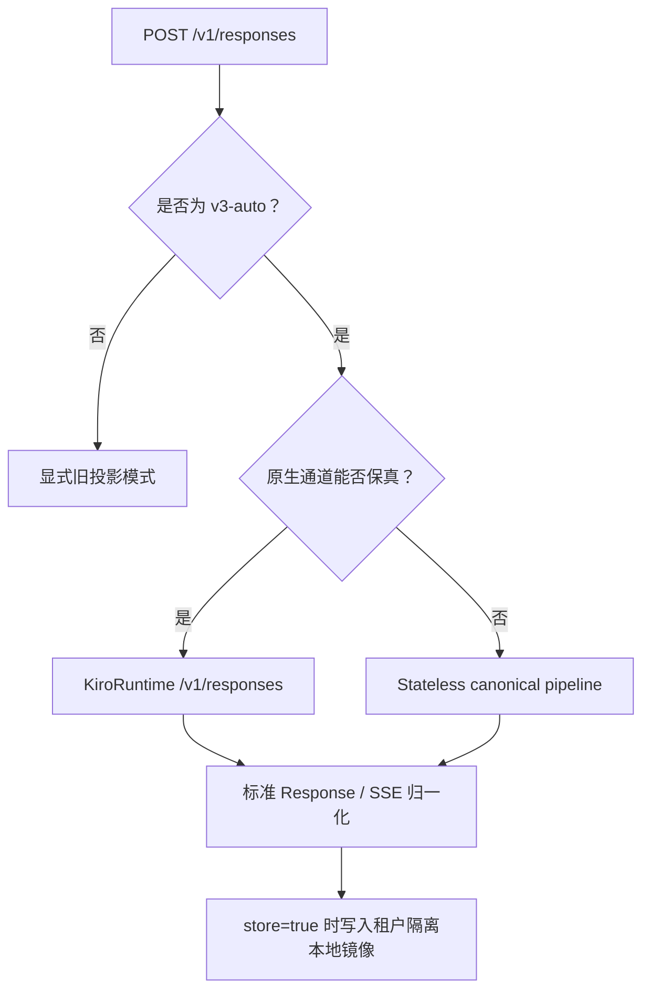

# V3 协议兼容范围

> **作者**：kiro-provider 维护者 · **日期**：2026-09-05 · **版本**：v3.0
> **受众**：运维人员、客户端开发者与发布评审者

## TL;DR

V3 将 OpenAI Responses 作为主要公开接口。默认 `v3-auto` 会把普通请求发送到
KiroRuntime 原生 `POST /v1/responses`，当原生操作无法保真承载请求时，自动
切换到成熟的 stateless pipeline。不支持的 OpenAI 能力会返回带类型的 OpenAI
错误 envelope，不会被静默丢弃。

## 目录

- [1. 公开 HTTP 接口](#1-公开-http-接口)
- [2. V3 传输选择](#2-v3-传输选择)
- [3. 原生 Responses 通道](#3-原生-responses-通道)
- [4. Stateless 兼容通道](#4-stateless-兼容通道)
- [5. Response 状态生命周期](#5-response-状态生命周期)
- [6. 请求能力矩阵](#6-请求能力矩阵)
- [7. Native-context 结论](#7-native-context-结论)
- [8. 错误与遥测契约](#8-错误与遥测契约)
- [9. 数据保留边界](#9-数据保留边界)
- [10. 验证证据](#10-验证证据)

## 1. 公开 HTTP 接口

| 方法与路径 | V3 行为 |
| --- | --- |
| `POST /v1/responses` | 创建流式或非流式 Response。 |
| `GET /v1/responses/{id}` | 读取租户隔离的本地 Response 镜像。 |
| `DELETE /v1/responses/{id}` | 删除本地镜像，并阻止后续网关续轮。 |
| `GET /v1/responses/{id}/input_items` | 支持 `after`、`limit` 1–100 与 `order`；默认 `desc`。 |
| `POST /v1/responses/{id}/cancel` | 对已终止镜像返回 `response_not_cancellable`；不支持 background 执行。 |
| `POST /v1/responses/input_tokens` | 识别该路径，但返回 HTTP 501 `unsupported_endpoint`。 |
| `POST /v1/responses/compact` | 识别该路径，但返回 HTTP 501 `unsupported_endpoint`。 |
| `POST /v1/messages` | Anthropic Messages 兼容接口。 |
| `POST /v1/messages/count_tokens` | Anthropic 兼容估算，并返回 `x-kiro-token-count-mode: estimate`。 |
| `POST /v1/chat/completions` | 旧接口；只有开启 `enable_legacy_chat_completions` 才可用。 |

OpenAI 官方 Responses 资源还定义了 create、retrieve、delete、cancel 与 input
items 方法。KiroRuntime 只提供原生创建与续轮，因此 V3 在本地实现其余核心
生命周期结构。

## 2. V3 传输选择



以下请求自动选择 stateless 通道：

- `store: false`；
- `max` effort 或 `-max` 模型变体；
- custom grammar 与 namespace 工具；
- Codex `additional_tools`、`agent_message` 与带 namespace 的调用历史；
- `parallel_tool_calls: false`；
- `include: ["reasoning.encrypted_content"]`。

引用原生已存储 Response 的请求会继续使用原生通道。如果新请求要求把该原生
lineage 切换到 stateless 通道，V3 会明确报错，不会弱化 `store`、effort、
工具或 reasoning 语义。

## 3. 原生 Responses 通道

原生通道调用：

```text
https://runtime.<region>.kiro.dev/v1/responses
```

Kiro CLI 2.21.1 使用同一个 KiroRuntime host。GPT Mantle 路由发生在服务端，
CLI 不会直接调用另一个公开 Mantle 端点。

已验证原生能力：

| 能力 | GPT-5.6 Sol | Claude Opus 5 |
| --- | --- | --- |
| `instructions` | 支持 | 支持 |
| 标准 Responses JSON 与 SSE | 支持 | 支持 |
| Function 工具 | 支持 | 支持 |
| `previous_response_id` | 结合 Response/账号亲和支持 | 结合 Response/账号亲和支持 |
| `max_output_tokens` | 支持 | 支持 |
| `reasoning.effort: xhigh` | 支持 | 支持 |
| `truncation: disabled` | 支持 | 支持 |
| `truncation: auto` | 支持 | 本地拒绝 |
| `temperature` | 本地拒绝 | 支持 |
| `top_p` | 本地拒绝 | 本地拒绝 |
| `max` effort | 切换 stateless | 切换 stateless |

Provider 会删除 `billing` 等私有上游字段，并在公开响应中保留客户端请求的模型
变体与归一化 OpenAI 字段。

## 4. Stateless 兼容通道

Fallback 通道先把请求转换为 Provider canonical IR，再使用既有
CodeWhisperer/Kiro 流式管道。它保留：

- 开头、中间与尾部指令的顺序；
- 任意非空文本字节，包括纯空白输入；
- 图片、内联文档、工具结果及其 current-input 边界；
- function、custom grammar 与 namespace 工具，并通过请求内私有别名恢复公开身份；
- Codex 协作 `agent_message` 的可见内容与 author/recipient 元数据；
- 通过租户绑定 `kr1_` token 回放 Kiro 签名或 redacted reasoning。

在 `v3-auto` 中，只有原生 Responses 通道不能承载请求时，该通道才使用显式
legacy 指令前缀。它不会把尾部指令移入更早历史，也不会构造空 current user。

> [!IMPORTANT]
> 为兼容当前 Codex，V3 接受 `parallel_tool_calls: false`，但 Kiro 没有提供
> 协议级“只允许串行工具调用”的保证。需要硬性串行保证的客户端应在自己的
> 工具调度器中执行约束。

## 5. Response 状态生命周期

V3 在 Provider 自有 SQLite 中镜像已存储 Response：

- 按租户隔离的 Response 与 input item JSON；
- 30 天 TTL；
- 最多 10,000 条的有界保留；
- 用于 cursor 分页的稳定 input item ID；
- stateless 续轮所需的可选 canonical request/completion；
- 原生 KiroRuntime 续轮所需的 Response/账号亲和。

只有同一租户镜像中存在的 ID 才能作为 `previous_response_id`。未知、过期、
跨租户或本地已删除的 ID 返回 HTTP 404 `response_not_found`。

`DELETE` 只删除网关本地镜像。KiroRuntime 的 retrieve、input-items 与 delete
真实探针均返回 HTTP 404，因此 V3 无法证明或请求 Kiro 服务端物理删除。

## 6. 请求能力矩阵

| 请求能力 | V3 契约 |
| --- | --- |
| 文本、消息数组、图片、内联文档 | 在已记录的 Kiro 格式限制内支持。 |
| `instructions`、`system`、`developer` | 普通 V3 通道使用原生字段；stateless fallback 保序投影。 |
| Function 工具 | 能走原生时走原生，否则 fallback。 |
| Custom grammar 与 namespace 工具 | Stateless fallback，并在响应中恢复公开身份。 |
| `agent_message` | Stateless fallback；保留可见内容，不把子代理加密元数据注入父模型。 |
| `tool_choice: auto` / `none` | 在不存在冲突的未完成工具状态时支持。 |
| Required、指定或受约束 tool choice | 拒绝。 |
| `strict: true` | 拒绝，因为 Kiro 无法保证 strict schema。 |
| `store: true` / 省略 | 支持并写入本地镜像。 |
| `store: false` | 走 stateless，不写本地 Response 镜像。 |
| `previous_response_id` | 支持本地镜像中的原生或 stateless Response。 |
| Responses `conversation` 对象 | 返回 `unsupported_stateful_responses`。 |
| Structured Outputs / JSON schema | 返回 `unsupported_structured_output`。 |
| 内置 Web Search、File Search、Computer Use、托管 MCP | 拒绝；V3 不伪造托管工具或引用事件。 |
| 远程图片 URL 与 OpenAI `file_id` | 拒绝；应发送 data URL 或内联文件数据。 |
| `background: true` | 拒绝。 |
| Prompt template、moderation、context management | 拒绝。 |
| `metadata`、`client_metadata`、`prompt_cache_key` | 用于响应回显、租户/会话路由或兼容元数据；不宣称等价于 Kiro prompt cache。 |
| `text.verbosity` | 作为兼容元数据接受；Kiro 没有经过验证的 verbosity 控制。 |

## 7. Native-context 结论

旧 GenerateAssistantResponse API 仍没有普遍可用且经过验证的指令通道：

- `additionalContext` 没有通过指令可见性与优先级探针；
- 当前账号 feature response 未公开 `system_field_injection` 或
  `system_prompt_migration`；
- Amazon Q Developer 设置页没有这两个 feature 的客户可见开关。

因此：

- 显式 `safe` 对指令角色继续默认拒绝；
- `native-context-safe` 只有在服务端公开所需 feature 后才使用
  `systemPrompt`；
- 默认 `v3-auto` 使用独立 KiroRuntime CreateResponse 的 `instructions`
  字段实现安全原生指令。

Legacy 投影没有固定删除日期，移除继续采用证据门控。

## 8. 错误与遥测契约

Responses 与 Chat 使用 OpenAI error envelope，并保留 `code` 与 `param`；
Anthropic 使用 Anthropic error envelope。

不含正文的遥测使用一个 `request_id` 串联：

1. 请求形态；
2. 投影完成；
3. history 构建；
4. 每次真实 SDK/native dispatch；
5. completion witness；
6. stream terminal。

日志只包含计数、枚举、长度和哈希，不记录 prompt、工具参数、凭据、reasoning
签名、回放 token 或原始捕获。

## 9. 数据保留边界

`store: false` 会阻止网关写入本地 Response 镜像，并选择 stateless 传输。
这不等于宣称 AWS Zero Data Retention。KiroRuntime 真实探针即使收到
`store: false`，仍报告 `store: true`，因此 V3 不会把该形态发送到原生通道。

临时 CLI 拦截产物与复制的账号数据库属于测试秘密。只应保留脱敏证据，并在
结束后删除原始文件。

## 10. 验证证据

V3 候选已通过：

- 1,531 个仓库测试；
- TypeScript typecheck、lint、binary build 与 `git diff --check`；
- 隔离 SQLite `PRAGMA integrity_check=ok`；
- 原生非流式、标准 SSE、function 工具与 `previous_response_id` 探针；
- Codex CLI 0.153.0 的连通、custom command、命令失败恢复，以及 namespace
  协作（`spawn_agent`、子代理结果与 `wait`），且私有别名零泄漏。

详细实现与真实探针证据：

- [V3 OpenAI Responses 验证](../audits/kiro-provider-v3-openai-responses-validation-2026-09-05.zh.md)
- [请求投影优化](../audits/kiro-provider-projection-optimization-2026-09-05.zh.md)
- [审计索引](../audits/README.md)

OpenAI 官方方法参考：

- [Create a response](https://developers.openai.com/api/reference/resources/responses/methods/create)
- [Retrieve a response](https://developers.openai.com/api/reference/resources/responses/methods/retrieve)
- [Delete a response](https://developers.openai.com/api/reference/resources/responses/methods/delete)
- [Cancel a response](https://developers.openai.com/api/reference/resources/responses/methods/cancel)
- [List input items](https://developers.openai.com/api/reference/resources/responses/subresources/input_items/methods/list)
